# boost-converter-c2000

**Author:** Alphy Ajit Cherian

# Executive Summary

This report documents the design, implementation, and efficiency characterisation of a **12V-24V** boost converter operating at a switching frequency of **50KHz** on a **TI C2000** microcontroller. The process involved 3 hardware iterations: non-synchronous, synchronous, and closed-loop PI control. Peak efficiency of **92.59%** (non-synchronous topology) was measured at light load (50mA) with steep roll-off past 400mA load - 80.81% (non-synchronous), 84.12% (synchronous) - attributed to inductor saturation of the custom wound E-ferrite core. Synchronous topology yielded a **1% to 3%** efficiency improvement across 100-400mA load. Closed-loop control held output voltage within **0.15V (0.63%)** of the 24V target across a load sweep from 50-400mA.

  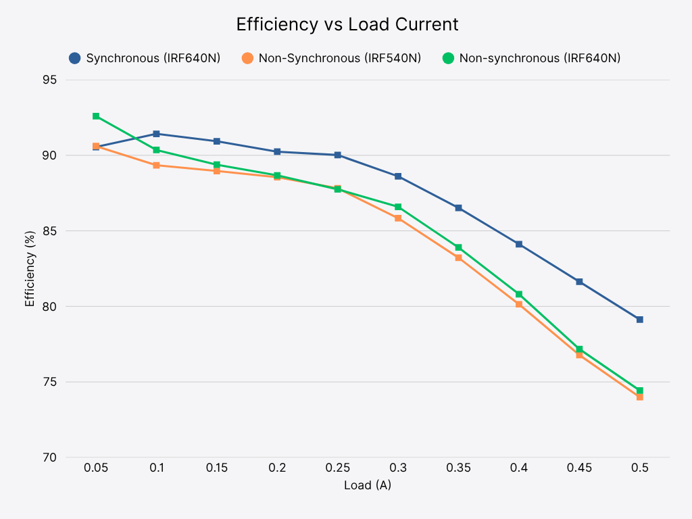

  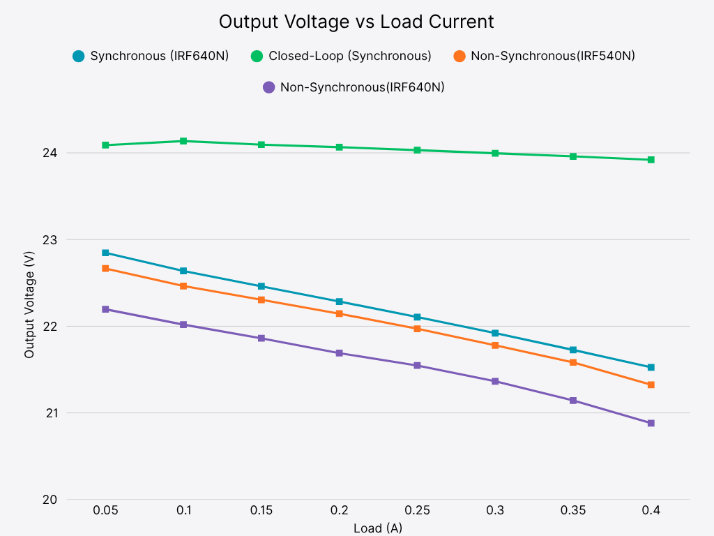

# Design Specifications

## Specifications

| Parameter | Symbol | Value |
| :--- | :---: | :---: |
| Input voltage | $V_{in}$ | 12 V |
| Output voltage | $V_{out}$ | 24 V |
| Rated output current | $I_o$ | 1 A |
| Switching frequency | $f_{s}$ | 50 kHz |
| Inductor current ripple | $\Delta I_L$ | 20% |
| Output voltage ripple | $\Delta V$ | 5% |

## Duty Cycle (D)

$D = 1 - \frac{V_{in}}{V_{out}} = 1 - \frac{12}{24} = 0.5 \tag{1}$

## Average Inductor Current $$I\_{L,avg}$$

$I\_{L,avg} = \\frac{I\_o}{1 - D} = \\frac{1}{0.5} = 2 \\text{ A} \\tag{2}$

## Inductor Sizing

$L = \\frac{V\_{in} \\cdot D}{\\Delta I\_L \\cdot f\_{s}} = \\frac{12 \\times 0.5}{0.4 \\times 50 \\times 10^3} = 300 \\ \\mu \\text{H} \\tag{3}$

where $\\Delta I\_L = 0.2 \\times I\_{L,avg} = 0.4 \\text{ A}$.

An E-ferrite core inductor was wound to approximately $300 \\ \\mu\\text{H}$.

## Output Capacitor Sizing

Using $\\Delta V = 5\\%\\text{ of } V\_{out} = 1.2 \\text{ V}$:

$C\_{out} = \\frac{I\_o \\cdot D}{\\Delta V \\cdot f\_{s}} = \\frac{1 \\times 0.5}{1.2 \\times 50 \\times 10^3} = 8.3 \\ \\mu\\text{F} \\tag{4}$

A $33 \\ \\mu\\text{F}$ capacitor was selected to achieve lower output ripple.

# Implementation

All three iterations were built on a breadboard.

## Part 1: Non-Synchronous topology

A D30E120 diode was used. The low side MOSFET was driven via a TLP350 gate driver from C2000 Piccolo MCU F280049C LaunchPad ePWM output at fixed 50% duty cycle. A simplified schematic is shown below.

  

### Simulation

The circuit was simulated in LTSpice. Although a manufacturer SPICE subcircuit model exists for the IRF640N, a Level 1 MOSFET model was used instead with parasitic gate-drain, gate-source, and drain-source capacitances. This approach was taken so that the circuit could be implemented in a custom circuit simulator built previously, allowing its output to be cross-verified with LTSpice. No SPICE parameters were found for the D30E120 diode, so a 
generic diode was used in its place. As a result, the simulated output is not component specific and should be taken as approximate. See [netlist](assets/simulation/non-synchronous_netlist.cir)

  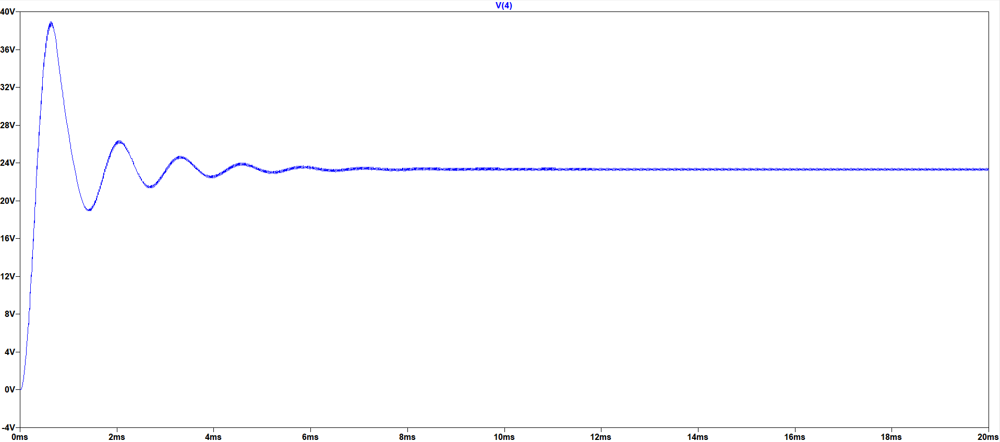

Peak transient overshoot is observed to be around 39V. At steady state, output voltage settles to an average of approximately 23.3V with a ripple of around 0.3V. The custom simulator's output showed a close match with the waveform observed in LTSpice.

  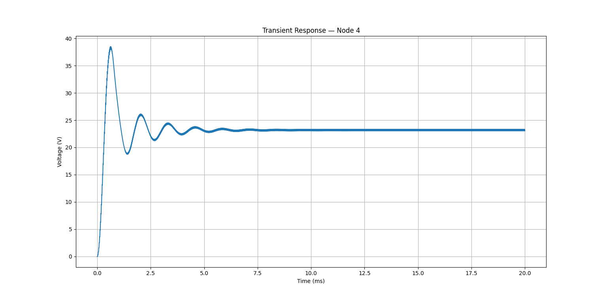

The need for soft-start in preventing initial output voltage overshoot and large inrush current was realised. This was implemented in the ePWM interrupt service routine. The value in the compare register is incremented by 1 over 50 PWM cycles, ramping to the desired final value of 1000 over 1 second. 

### Results

Output voltage obtained at light load (50mA) was 22.196V at an efficiency of 92.59%. Both efficiency and output voltage dropped with increasing load. Above approximately 400mA, the converter failed to reach steady state even after 15s. The output voltage continuously dropped and MOSFET heated up significantly. This is indicative of inductor saturation; Inductance drops rapidly and behaves as a short circuit. At a given load, the IRF540N produced higher output voltage than the IRF640N, consistent with its lower $R_{DS(on)}$ ($44m\Omega$ vs $150m\Omega$) which reduces conduction losses. 

  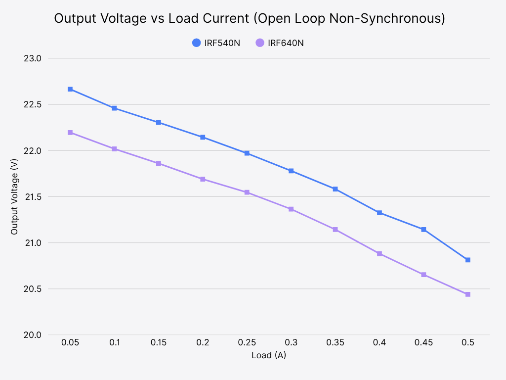

### Efficiency Measurements

Measured using a Keithley DC Electronic Load. Efficiency was measured both for IRF640N and IRF540N. IRF640N was found to consistently yield higher overall efficiency and hence was selected for further hardware iterations. Efficiency curves for the two are shown below. Note that readings above 400mA were taken 5-10s after converter startup and cannot be taken as conclusive results due to the non-steady state behaviour mentioned above.

  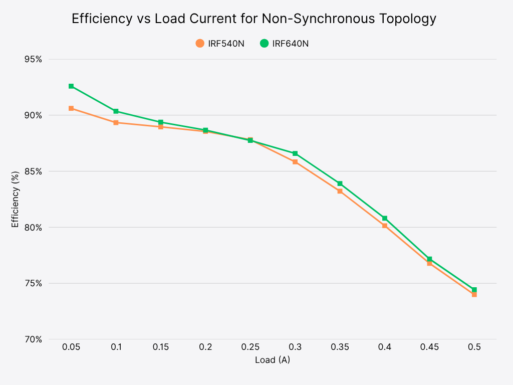

> Note: Soft-start has been extended to 4s for visualisation purposes.

https://github.com/user-attachments/assets/e9330696-3960-4b1e-9ea8-92d7e14ccc6c

## Part 2: Synchronous topology

The high side MOSFET is switched in a complementary manner to the low side MOSFET, leading to lower conduction losses. Simplified schematic shown below.

  

Dead time was implemented on the MCU. This is where a deliberate delay is introduced where both MOSFETs are kept in the OFF state preventing shoot-through which occurs when both are ON. The dead band module was used for this. A dead time of 500ns was set. The following formula was used to calculate dead time:

$$t\_{dead}=\[(t\_{d,off,max}-t\_{d,on,min}+t\_f) + (t\_{pdd,max}-t\_{pdd,min})] \\cdot 1.2$$

Where,

$$t\_{d,off,max}$$ : the maximal turn off delay time.

$$t\_{d,on,min}$$ : the minimal turn on delay time.

$$t\_f$$ : fall time

$$t\_{pdd,max}$$ : the maximal propagation delay of driver.

$$t\_{pdd,min}$$ : the minimum propagation delay of driver.

1.2 : safety margin to be multiplied

### Results

Peak efficiency was 91.42% at 100mA load. This rapidly dropped to 84.12% at 400mA. Beyond this load, although the circuit did not get hot (as opposed to the non-synchronous topology), the aforementioned non-steady state behaviour was observed. Output voltage dropped significantly along with efficiency and hit 58.42% at 800mA load - rendering the converter practically useless. Oscilloscope waveforms at 50mA load are shown below.

  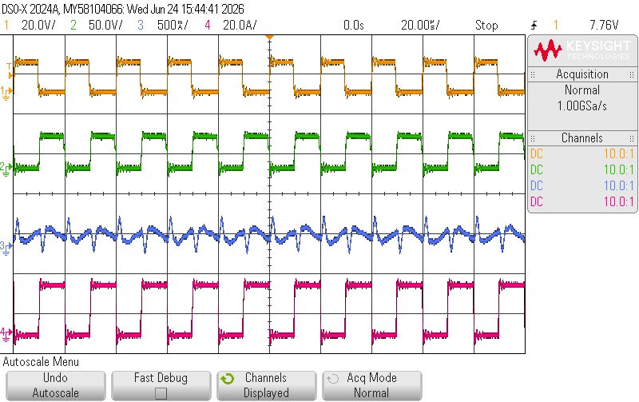

Where, the orange waveform is gate source voltage of the high side MOSFET, green is that of the low side, magenta represents the switching node voltage, and blue the inductor current. As the load is increased (see below), the inductor current waveform spikes and has a parabolic shape instead of triangular nature. This is characteristic of inductor saturation. 

  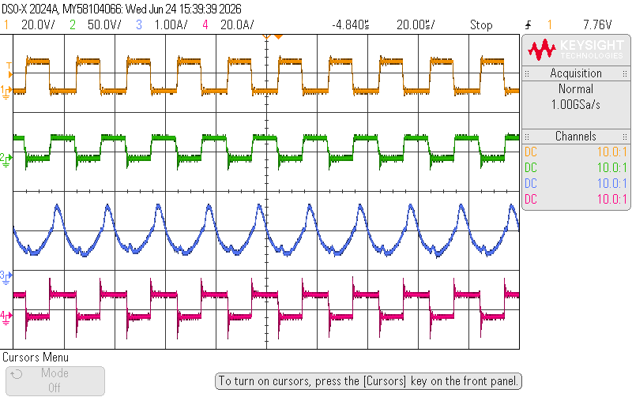

  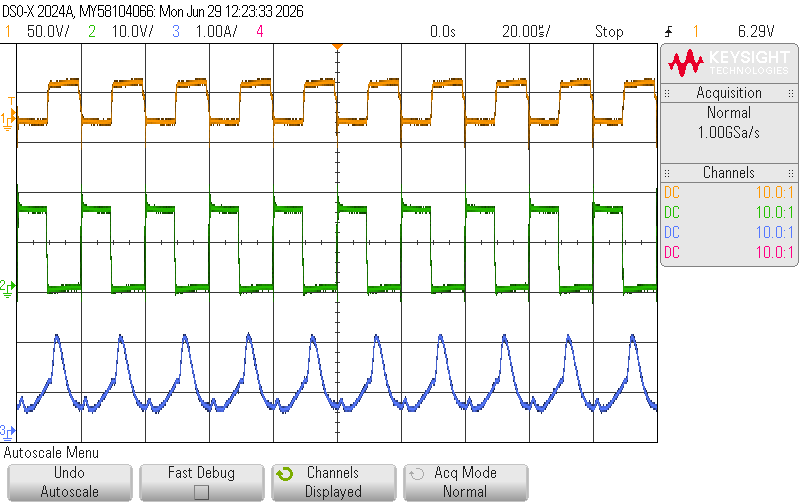

  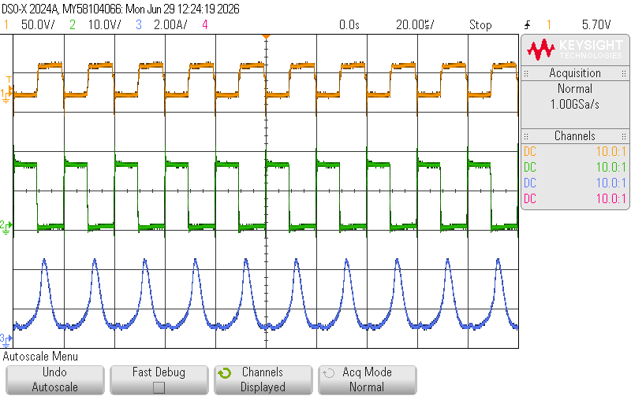

## Part 3: Digital PI control

Although the output voltage of an ideal boost converter does not depend on the load, practically, parasitic resistances of the MOSFETs, inductors, etc cause a drop in voltage with increasing load. Hence, the need for closed loop control arises.

### Implementation

A resistor voltage divider - $$510k\\Omega, 22k\\Omega$$ - was used to lower the 24V output down to around 1V, fitting within the ADC input range (0-3.3V). A 100nF capacitor was placed across the $$22k\\Omega$$ resistor to filter switching noise. Within firmware, this input voltage was then scaled back to 24V range using empirically derived constants (see [firmware](firmware/synchronous_closed_loop.c) for further details). 

The PI controller was implemented in the ADC interrupt service routine which fires once every PWM interrupt (every $$20\\mu s$$). Once soft-start completes and duty cycle reaches 50%, the controller kicks in. The ADC reading is scaled up, compared with the 24V reference to generate an error term. 

$$e\[k] = 24 - V\_{out}$$

$$\\text{D\[k]} = KP \\cdot e\[k] + KI \\cdot \\Sigma\_{j=0}^k e\[k] + 50$$

Where e\[k] is the error and D\[k] the duty cycle at k^{th} step. KP and KI are constants which were empirically found to be 0.1 and 0.001 respectively. 

Anti-windup was implemented in firmware by stopping integral error accumulation when duty cycle saturates at upper (0.65) and lower (0.15) bounds. The computed duty cycle D\[k] is mapped to its compare value as follows:

$$\\text{CMP\[k]} = D\[k] \\cdot 2000$$

### Results

  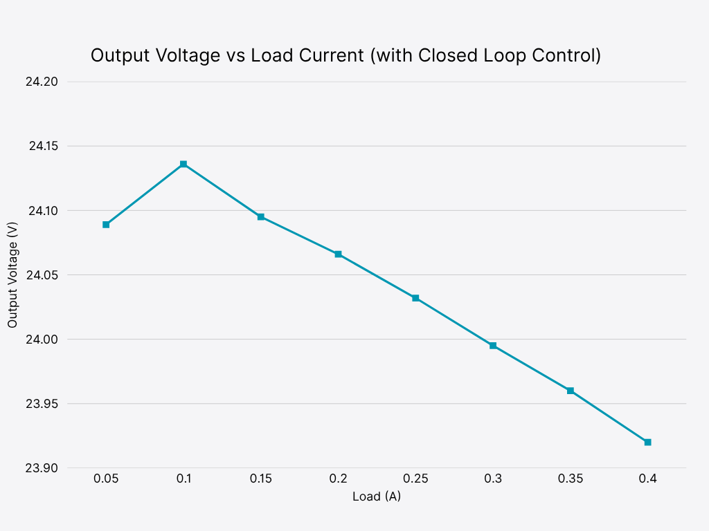

The ability to maintain 24V across the load was tested across a load sweep from 50-400mA. Digital PI control held output voltage within 0.15V (0.63%) of the 24V target across a load sweep from 50-400mA. Incidentally, a major issue with this setup is that the cutoff frequency of the RC filter is:

$$f\_c = \\frac{1}{2\\pi RC} \\approx 72.34Hz$$

This significantly cuts the bandwidth of the system and prevents controller from reacting to rapid changes in load. Occasionally, the inductor produced a hissing sound whose cause may be attributed to the large phase lag.

# Failure Analysis & Future Improvements

## Inductor Saturation

The steep drop in efficiency at higher load is most consistent with inductor saturation. Considering a 1A load, average inductor current is 2A and with 0.4A ripple, that translates to 2.2A peak current (under ideal case and ignoring any start-up transients). Hence, future work should use a power inductor rated for at least 3A for an output current rating of 1A. 

## Low Feedback Bandwidth

The 100nF capacitor across the feedback resistor divider, which was used for filtering ADC noise introduced large phase lag. This may be the reason behind the inductor hissing sound observed. During my testing, as the load change was quite slow and took place over a couple seconds, the controller managed to hold up alright. However in practice, stabilising output voltages over seconds is simply unacceptable. 

## Breadboard Setup

Breadboard have internal parasitic inductances and capacitances, forming LC resonant circuits causing ringing. This was visible on the oscilloscope screen throughout the process. Ringing degrades components and also leads to lower efficiency. A PCB layout would considerably improve this. 
